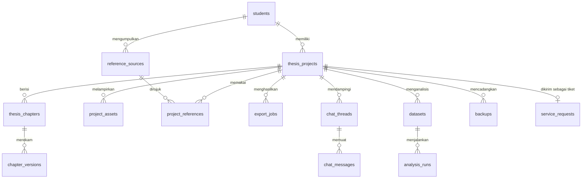
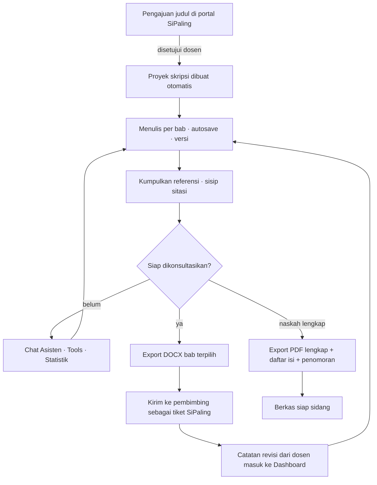

# Cetak Biru — Ruang Kerja Skripsi Mahasiswa

Pembacaan menyeluruh atas tangkapan layar aplikasi **Thesis Pro**, diterjemahkan
menjadi rancangan yang bisa dibangun di atas SiPaling FISIP.

> **Status:** dokumen rancangan. Belum ada satu baris kode pun dari isi dokumen
> ini yang dibangun di repositori. Angka waktu adalah perkiraan, bukan janji.
>
> **Sumber:** satu tangkapan layar (halaman *Dokumen Export*), ditambah
> pembacaan kode SiPaling FISIP yang sudah berjalan.

---

## 0. Cara membaca dokumen ini

Setiap pernyataan tentang aplikasi pada gambar diberi penanda supaya tidak
tertukar antara fakta dan tafsiran:

| Penanda | Arti |
| --- | --- |
| **[T]** | **Terlihat** langsung pada gambar. Bisa diverifikasi siapa pun. |
| **[D]** | **Dugaan** dari nama menu, konvensi aplikasi sejenis, atau alur yang masuk akal. Perlu dikonfirmasi dengan tangkapan layar halaman terkait. |
| **[U]** | **Usulan** saya — tidak ada pada Thesis Pro, ditambahkan karena konteks FISIP UMT menuntutnya. |

Kode fungsi (`F-EXP-03`, `F-REF-01`, …) dipakai sebagai rujukan tetap di seluruh
dokumen, roadmap, dan nanti di pesan commit.

---

## 1. Pembacaan gambar

### 1.1 Kerangka aplikasi

| Bukti | Bacaan |
| --- | --- |
| **[T]** Bilah judul "Thesis Pro" dengan tombol minimize / maximize / close | Aplikasi **desktop**, bukan tab peramban. Kemungkinan Electron atau Tauri. Konsekuensinya besar dan dibahas di §6.1. |
| **[T]** Sidebar berlabel "MENU" + ikon lipat di kanan header sidebar | Navigasi tetap, bisa diciutkan jadi rel ikon. |
| **[T]** 9 butir menu + toggle **Mode Gelap** terpisah di kaki sidebar | Toggle bukan menu; ia pengaturan yang dinaikkan derajatnya karena sering dipakai. |
| **[T]** Butir aktif (**Dokumen Export**) diberi latar lavender + ikon berwarna | Satu penanda aktif, tanpa breadcrumb. Kedalaman navigasi hanya satu tingkat. |
| **[T]** Selektor **Proyek** di kanan atas berisi judul penelitian panjang | Konteks **global**: ganti proyek sekali, seluruh menu ikut berganti. Aplikasi mendukung banyak naskah per pengguna. |
| **[T]** Header halaman: ikon + judul + subjudul prosedural "Pilih format → export → pilih lokasi penyimpanan" | Pola tetap tiap halaman: judul menyebut *benda*, subjudul menyebut *urutan langkah*. Ini keputusan desain yang layak ditiru. |
| **[T]** Dua kolom: kiri = pemilih isi, kanan = pilihan keluaran (bertumpuk) | Kiri "apa yang diekspor", kanan "jadi apa". Kolom kanan bisa lebih dari dua kartu (ada kartu ketiga yang terpotong di bawah). |
| **[D]** Tidak ada tombol "Export" yang terlihat | Kemungkinan tombol aksi berada di bawah lipatan, atau melekat sebagai bilah tetap di kaki halaman. |

### 1.2 Layar Dokumen Export, dibedah

**Kartu "Pilih Bab" [T]**

- Ringkasan hidup: `6 dari 6 bab dipilih · Bab 1 s/d Daftar Pustaka` — mencampur
  hitungan dan rentang. Rentang menjawab "yang mana", hitungan menjawab
  "berapa". Keduanya diperlukan.
- Dua tombol pintas: **Semua** (dalam keadaan aktif/terisi) dan **Kosongkan**.
- Enam baris, masing-masing dengan kotak centang, judul huruf kapital, dan
  sublabel urutan:
  `BAB I PENDAHULUAN` (Bab 1), `BAB II TINJAUAN PUSTAKA` (Bab 2),
  `BAB III METODOLOGI PENELITIAN` (Bab 3), `BAB IV HASIL DAN PEMBAHASAN` (Bab 4),
  `BAB V KESIMPULAN DAN SARAN` (Bab 5), `DAFTAR PUSTAKA` (Bab 6).
- **Baca lebih dalam:** Daftar Pustaka diperlakukan sebagai *bab bernomor 6*,
  bukan bagian belakang naskah. Sederhana untuk diprogram, tetapi keliru secara
  tipografi (daftar pustaka tidak diberi nomor bab dan tidak masuk penomoran
  BAB). Lihat §4.4 → jebakan.
- **Tidak terlihat:** halaman judul, lembar pengesahan, abstrak, kata pengantar,
  daftar isi, daftar tabel/gambar, lampiran. Padahal itulah bagian yang paling
  sering ditolak admin akademik. **[U]** Rancangan saya menambahkannya sebagai
  kelompok *Bagian Awal* dan *Bagian Akhir*.

**Kartu "Format file" [T]**

| Format | Label pada gambar | Bacaan teknis |
| --- | --- | --- |
| PDF | "Siap cetak (rekomendasi)" — dalam keadaan terpilih | Format akhir. Butuh mesin paginasi sungguhan (§6.5). |
| DOCX | "Microsoft Word modern" | Format kerja: dosen memberi komentar & *track changes* di sini. |
| DOC | "Word kompatibel HTML" | Label ini jujur: yang dihasilkan bukan biner DOC 1997, melainkan HTML ber-MIME Word. Tetap dibuka Word. |
| HTML | "Halaman web offline" | Berkas tunggal, CSS tertanam, gambar sebagai data URI. |
| TXT | "Teks polos" | Untuk pemeriksa kemiripan dan alat statistik teks. |
| RTF | "Rich Text Format" | Kompatibilitas ke pengolah kata lama. |

Satu format dipilih dalam satu waktu (kartu PDF diberi bingkai + latar terpilih),
bukan multi-pilih.

**Kartu "Opsi layout" [T]**

- Judul kartu diikuti ringkasan hidup `A4 · portrait · PDF` — ringkasan ikut
  menyebut format yang sedang dipilih, jadi kartu ini **bereaksi** terhadap
  kartu Format. **[D]** Artinya opsi tertentu (mis. margin) kemungkinan
  disembunyikan/dinonaktifkan untuk TXT.
- Kontrol terlihat: **Ukuran kertas** (A4), **Orientasi** (Portrait), dan
  **Margin (cm)** yang terpotong di tepi bawah.

### 1.3 Bahasa desain [T]

Aksen lavender/ungu; kartu putih bersudut besar dengan garis tepi tipis; ikon
bergaya garis (*outline*); tipografi sans-serif satu keluarga dengan dua bobot;
tanpa bayangan berat; ruang kosong lega. Keadaan terpilih ditandai **latar +
garis tepi**, bukan hanya warna teks — ini penting untuk keterbacaan.

### 1.4 Yang tidak bisa disimpulkan dari gambar

Tidak ada bukti mengenai: cara masuk/akun, tempat naskah disimpan (lokal atau
server), apakah ada koneksi ke kampus, apakah Chat Asisten memakai LLM daring,
apakah ada kolaborasi dengan pembimbing, dan bagaimana penomoran halaman
dikelola. Semua itu ditandai **[D]** atau **[U]** di bawah, dan yang paling
menentukan dijadikan **keputusan terbuka** di §13.

---

## 2. Tujuh prinsip perancangan

1. **Naskah adalah data, bukan berkas.** Yang disimpan adalah struktur (bab →
   subbab → paragraf → sitasi), bukan seonggok `.docx`. Ekspor selalu bisa
   dilahirkan ulang; berkas tidak pernah jadi sumber kebenaran.
2. **Format kampus adalah preset, bukan pekerjaan mahasiswa.** Margin, jenis
   huruf, spasi, penomoran halaman romawi→arab: dipilih sekali dari daftar,
   tidak diatur manual per ekspor.
3. **Ringkasan hidup di setiap kartu.** Pola "6 dari 6 bab dipilih",
   "A4 · portrait · PDF" dari gambar dipakai di seluruh aplikasi: setiap kartu
   pengaturan menyatakan hasil akhirnya dengan bahasa manusia.
4. **AI mendampingi, tidak menulis menggantikan.** Batas ini bukan sopan-santun,
   melainkan syarat agar aplikasi boleh dipakai di lingkungan kampus (§10).
5. **Tidak ada pekerjaan yang hilang.** Autosave, riwayat versi, cadangan
   berjadwal, dan berkas ekspor yang bisa diunduh ulang.
6. **Satu jalan ke pembimbing.** Naskah yang selesai diekspor bisa langsung
   masuk ke alur tiket SiPaling yang sudah ada — bukan lewat WhatsApp.
7. **Jujur soal batas.** Pemeriksa kemiripan lokal bukan Turnitin; uji statistik
   bawaan bukan pengganti pemahaman metode. Aplikasi harus mengatakannya di
   layar, bukan menyembunyikannya.

---

## 3. Peta modul

| # | Modul | Kode | Nilai bagi mahasiswa | Kesulitan | Bergantung pada |
| --- | --- | --- | --- | --- | --- |
| 1 | Dashboard | `DSH` | Tahu posisi & langkah berikutnya | Rendah | `PRJ` |
| 2 | Proposals & Skripsi | `PRJ` | Tempat naskah hidup | **Tinggi** | akun, skema |
| 3 | Referensi & Sitasi | `REF` | Daftar pustaka otomatis & konsisten | Sedang | `PRJ` |
| 4 | Dokumen Export | `EXP` | Berkas siap kirim/cetak | **Tinggi** | `PRJ`, `REF` |
| 5 | Chat Asisten | `CHT` | Pendamping saat buntu | Sedang | `PRJ`, kebijakan §10 |
| 6 | Tools Skripsi | `TLS` | Menangkap kesalahan sebelum dosen | Sedang | `PRJ`, `REF` |
| 7 | Statistik | `STA` | Olah data tanpa SPSS | **Tinggi** | `PRJ` |
| 8 | Backup & Restore | `BKP` | Jaminan naskah tidak hilang | Rendah | `PRJ` |
| 9 | Pengaturan | `SET` | Identitas + preset format | Rendah | — |
| 10 | Mode Gelap | `SET-04` | Kenyamanan menulis malam | Sepele | — |

Urutan pembangunan yang benar bukan urutan sidebar. Lihat §11.

---

## 4. Rincian modul

### 4.1 `DSH` — Dashboard

**Pertanyaan yang dijawab:** "Sudah sampai mana saya, dan apa yang harus saya
kerjakan hari ini?"

| Kode | Fungsi | Catatan |
| --- | --- | --- |
| `F-DSH-01` | Cincin progres per bab: *Belum ditulis · Draf · Direvisi · Disetujui pembimbing* | **[U]** Status "Disetujui" hanya boleh diubah lewat modul bimbingan, bukan oleh mahasiswa |
| `F-DSH-02` | Hitungan kata & halaman perkiraan, total dan per bab | Halaman = kata ÷ kepadatan preset (≈300 kata/halaman A4 spasi 2) |
| `F-DSH-03` | Hitung mundur ke tenggat (seminar proposal, sidang) | Sumber tenggat: input mahasiswa **[U]** atau pengumuman prodi |
| `F-DSH-04` | Peta panas menulis 12 minggu terakhir | Dari `chapter_versions.created_at` — tanpa tabel baru |
| `F-DSH-05` | Kartu "Langkah berikutnya" — 3 tindakan yang dihitung sistem | Contoh: "BAB II punya 4 sitasi tanpa entri daftar pustaka" → tombol menuju `TLS` |
| `F-DSH-06` | Catatan pembimbing terbaru + status tiket SiPaling | **[U]** integrasi; lihat §9 |
| `F-DSH-07` | Target harian kata & rentetan hari menulis | Motivasi ringan, bisa dimatikan di `SET` |

**Jebakan:** dashboard yang penuh grafik tapi tidak menyuruh apa pun akan
diabaikan setelah minggu kedua. `F-DSH-05` adalah alasan utama halaman ini ada;
sisanya pelengkap.

---

### 4.2 `PRJ` — Proposals & Skripsi

Ini jantungnya. Delapan modul lain hanya bermakna kalau modul ini benar.

| Kode | Fungsi | Rincian |
| --- | --- | --- |
| `F-PRJ-01` | CRUD proyek + selektor global | Persis selektor "Proyek" pada gambar **[T]** |
| `F-PRJ-02` | Templat struktur saat proyek dibuat | Skripsi kuantitatif · Skripsi kualitatif · Artikel jurnal · Proposal saja. Menentukan kerangka bab & subbab awal |
| `F-PRJ-03` | Pohon bab & subbab, bisa diseret-urutkan | Penomoran (1.1, 1.1.1) dihitung dari posisi, tidak pernah diketik manual |
| `F-PRJ-04` | Penyunting teks kaya terbatas | Yang diizinkan: heading 1–4, paragraf, tebal/miring, daftar, kutipan blok, tabel, gambar+keterangan, catatan kaki, rumus. **Yang dilarang: warna & jenis huruf bebas** — format datang dari preset |
| `F-PRJ-05` | Autosave + riwayat versi | Detail di §6.4 |
| `F-PRJ-06` | Sisip sitasi dari `REF` tanpa keluar dari penyunting | `Ctrl+K` → cari sumber → sisip simpul sitasi |
| `F-PRJ-07` | Komentar & catatan diri sendiri di margin | Tidak ikut terekspor |
| `F-PRJ-08` | Daftar periksa per bab | Contoh BAB I: latar belakang, rumusan masalah, tujuan, manfaat, batasan. Terhubung ke `F-TLS-05` |
| `F-PRJ-09` | Mode fokus | Sidebar & semua kartu disembunyikan; hanya teks |
| `F-PRJ-10` | Kirim bab ke pembimbing | **[U]** Membuat tiket di `service_requests` dengan lampiran DOCX hasil `EXP`. Lihat §9 |
| `F-PRJ-11` | Kelola aset: gambar & tabel | Disimpan di Supabase Storage; nomor & keterangan otomatis (`F-TLS-03`) |

**Aturan penting**

- Satu bab = satu dokumen; subbab adalah heading di dalamnya, bukan record
  terpisah. Ini menyederhanakan versi, ekspor, dan hitungan kata.
- Judul bab boleh diubah, nomornya tidak — nomor selalu turunan dari urutan.
- Menghapus bab = *soft delete* (`deleted_at`), karena mahasiswa panik lalu
  menyesal.

---

### 4.3 `REF` — Referensi & Sitasi

**Pertanyaan:** "Bagaimana daftar pustaka saya bisa benar tanpa saya rapikan
semalaman?"

| Kode | Fungsi | Rincian |
| --- | --- | --- |
| `F-REF-01` | Perpustakaan sumber per pengguna (dipakai lintas proyek) | Jenis: jurnal, buku, bab buku, prosiding, skripsi/tesis, laporan, berita, situs web, wawancara, dokumen hukum |
| `F-REF-02` | Tambah manual lewat formulir per jenis | Kolom wajib berbeda per jenis; validasi di server |
| `F-REF-03` | Impor otomatis dari **DOI** | Ambil metadata dari Crossref (`https://api.crossref.org/works/{doi}`), format transport CSL-JSON |
| `F-REF-04` | Impor dari tempelan **BibTeX / RIS** | Google Scholar & Mendeley mengeluarkan keduanya |
| `F-REF-05` | Impor dari **ISBN** | OpenLibrary API **[U]** |
| `F-REF-06` | Deteksi duplikat | Kunci: DOI sama, atau (judul ternormalisasi + tahun) mirip ≥ 0,9 |
| `F-REF-07` | Sisip sitasi dalam teks | Menyimpan `sourceId`, bukan teks. Berubah gaya = seluruh naskah ikut berubah |
| `F-REF-08` | Daftar pustaka otomatis | Hanya memuat sumber yang benar-benar dikutip; opsi "sertakan semua" tersedia |
| `F-REF-09` | Gaya sitasi | APA 7 (baku), ditambah gaya kampus jika pedoman FISIP UMT berbeda — **butuh dokumen pedoman resmi, lihat §13** |
| `F-REF-10` | Catatan & kutipan langsung per sumber | Menyimpan halaman kutipan agar sitasi `(Nama, 2023, h. 45)` bisa tepat |
| `F-REF-11` | Penanda "sumber lemah" | **[U]** blog, situs tanpa penulis, sumber >10 tahun untuk kajian teori — hanya peringatan, bukan larangan |

**Teknis:** simpan sumber dalam bentuk **CSL-JSON** di kolom `jsonb`, lalu
render dengan mesin gaya (`citeproc-js` + berkas gaya CSL). Menulis pemformat
APA sendiri terlihat mudah pada 5 kasus pertama dan menjadi mimpi buruk pada
kasus ke-30 (penulis korporat, tanpa tahun, editor, terjemahan, bab dalam buku).

---

### 4.4 `EXP` — Dokumen Export *(layar pada gambar)*

**Pertanyaan:** "Bagaimana naskah ini jadi berkas yang boleh saya kirim ke dosen
atau bawa ke percetakan?"

| Kode | Fungsi | Asal |
| --- | --- | --- |
| `F-EXP-01` | Pilih bab dengan centang + Semua/Kosongkan + ringkasan hidup | **[T]** |
| `F-EXP-02` | Pilih satu format dari enam | **[T]** |
| `F-EXP-03` | Opsi layout: ukuran kertas, orientasi, margin (cm) | **[T]** |
| `F-EXP-04` | Simpan ke lokasi pilihan pengguna | **[T]** dari subjudul; di web menjadi unduhan (§6.1) |
| `F-EXP-05` | Kelompok **Bagian Awal**: sampul, pengesahan, pernyataan orisinalitas, abstrak ID/EN, kata pengantar, daftar isi, daftar tabel, daftar gambar | **[U]** — bagian yang paling sering ditolak, justru absen dari gambar |
| `F-EXP-06` | Kelompok **Bagian Akhir**: lampiran, daftar riwayat hidup | **[U]** |
| `F-EXP-07` | Daftar isi otomatis dengan nomor halaman betul | **[U]** hanya mungkin kalau paginasi dilakukan mesin, bukan ditebak |
| `F-EXP-08` | Penomoran halaman romawi (bagian awal) → arab (mulai BAB I) | **[U]** syarat pedoman skripsi Indonesia pada umumnya |
| `F-EXP-09` | Preset format kampus sekali klik | **[U]** mis. "Pedoman FISIP UMT" mengunci margin/huruf/spasi |
| `F-EXP-10` | Pratinjau halaman sebelum ekspor | **[U]** mencegah siklus ekspor–buka–kecewa–ulangi |
| `F-EXP-11` | Watermark "DRAF — belum disetujui" | **[U]** opsional, mencegah draf beredar sebagai naskah final |
| `F-EXP-12` | Riwayat ekspor + unduh ulang | **[U]** berguna saat berkas hilang menjelang tenggat |

**Jebakan yang harus diperbaiki dari rancangan pada gambar**

1. **Daftar Pustaka bukan "Bab 6".** Ia bagian akhir tanpa nomor bab. Pada model
   data saya, `part` bernilai `front | chapter | back`, dan penomoran hanya
   berjalan pada `chapter`.
2. **Margin dalam cm tanpa preset itu jebakan.** Pedoman skripsi Indonesia
   lazimnya kiri 4 cm, atas 4 cm, kanan 3 cm, bawah 3 cm — **angka ini harus
   diverifikasi terhadap pedoman resmi FISIP UMT sebelum dijadikan baku**.
3. **Ekspor sebagian harus tetap sah.** Mengekspor hanya BAB II tidak boleh
   membuat nomor halaman dimulai dari 1 secara diam-diam; sediakan pilihan
   "lanjutkan penomoran" vs "mulai dari 1".

**Definisi selesai:** satu naskah lengkap dapat diekspor ke PDF dan DOCX,
dibuka di Word tanpa rusak, nomor halaman & daftar isi cocok, dan daftar pustaka
memuat persis sumber yang dikutip.

---

### 4.5 `CHT` — Chat Asisten

**Pertanyaan:** "Saya buntu jam 2 pagi dan tidak berani mengganggu pembimbing."

| Kode | Fungsi | Batas |
| --- | --- | --- |
| `F-CHT-01` | Percakapan sadar-konteks (tahu bab yang sedang dibuka) | Konteks dikirim sebagai kutipan terbatas, bukan seluruh naskah |
| `F-CHT-02` | Mode **Tanya Metode** | Menjelaskan pilihan metode, bukan memilihkan |
| `F-CHT-03` | Mode **Kritik Paragraf** | Menunjukkan kelemahan argumen & bukti yang kurang |
| `F-CHT-04` | Mode **Rapikan Bahasa** | Ejaan, kalimat >30 kata, kata tidak baku — menyunting kalimat mahasiswa, bukan mengarang baru |
| `F-CHT-05` | Mode **Cari Celah Logika** | Konsistensi rumusan masalah ↔ tujuan ↔ kesimpulan |
| `F-CHT-06` | Mode **Latihan Sidang** | Membuat pertanyaan penguji dari isi naskah — fitur yang paling diminati mahasiswa |
| `F-CHT-07` | Catatan penggunaan AI | Setiap percakapan tersimpan & bisa diekspor sebagai lampiran transparansi (§10) |
| `F-CHT-08` | Tombol "jelaskan istilah ini" dari dalam penyunting | Seleksi teks → tanya |

**Yang sengaja TIDAK ada:** "tuliskan BAB II saya", "buatkan 3000 kata tentang
X". Alasannya di §10, dan itu bukan pembatasan yang bisa ditawar kalau aplikasi
ini mau dipakai resmi oleh fakultas.

Rincian teknis (model, biaya, streaming, caching): §6.8.

---

### 4.6 `TLS` — Tools Skripsi

Alat-alat kecil yang menangkap kesalahan sebelum dosen menangkapnya.

| Kode | Alat | Cara kerja |
| --- | --- | --- |
| `F-TLS-01` | **Pemeriksa sitasi yatim** | Dua arah: sitasi dalam teks tanpa entri daftar pustaka, dan entri yang tidak pernah dikutip |
| `F-TLS-02` | **Kemiripan internal** | *Shingling* 5-gram + kemiripan Jaccard antar bab, dan terhadap dokumen yang diunggah sendiri. **Bukan Turnitin** — layar wajib mengatakan ini |
| `F-TLS-03` | **Penomoran tabel & gambar** | Menomori ulang berurutan, memeriksa setiap tabel/gambar dirujuk di teks ("...pada Tabel 4.2") |
| `F-TLS-04` | **Konsistensi istilah** | Mendeteksi "technoference"/"tekno-ference"/"Technoference" dalam satu naskah |
| `F-TLS-05` | **Pemeriksa struktur** | Jumlah rumusan masalah = jumlah tujuan = jumlah kesimpulan; heading yang melompat (1.1 → 1.3) |
| `F-TLS-06` | **Kalkulator ukuran sampel** | Slovin, Isaac & Michael, Krejcie–Morgan, Lemeshow (proporsi). Menampilkan **rumus** dan hasil, agar bisa disalin ke BAB III |
| `F-TLS-07` | **Keterbacaan & bahasa** | Kalimat >30 kata, paragraf >250 kata, kata tidak baku, penggunaan "dimana" sebagai penghubung |
| `F-TLS-08` | **Hitung kata per bab & perkiraan halaman** | Sumber angka bagi `F-DSH-02` |
| `F-TLS-09` | **Konverter tabel** | Tempel dari Excel → tabel bernomor berformat kampus |
| `F-TLS-10` | **Pemeriksa kelengkapan berkas sidang** | **[U]** daftar periksa administratif yang mengacu ke persyaratan prodi |

---

### 4.7 `STA` — Statistik

Modul dengan nilai tertinggi bagi mahasiswa kuantitatif FISIP, dan **repositori
ini sudah punya paket `xlsx`** — jalur impor datanya sudah tersedia.

| Kode | Fungsi | Rincian |
| --- | --- | --- |
| `F-STA-01` | Impor data dari XLSX/CSV | Pemetaan kolom → variabel, penanganan sel kosong |
| `F-STA-02` | Kamus variabel | Nama, label, skala (nominal/ordinal/interval/rasio), nilai hilang |
| `F-STA-03` | Statistik deskriptif | Frekuensi, mean, median, modus, SD, min/maks, skewness |
| `F-STA-04` | Uji validitas instrumen | Korelasi item–total terkoreksi (Pearson) + r tabel |
| `F-STA-05` | Uji reliabilitas | Cronbach's Alpha per konstruk |
| `F-STA-06` | Uji asumsi klasik | Normalitas (Kolmogorov–Smirnov / Shapiro–Wilk), linearitas, multikolinearitas (VIF), heteroskedastisitas (Glejser) |
| `F-STA-07` | Regresi linear sederhana & berganda | Koefisien, t, F, R², adjusted R² |
| `F-STA-08` | Korelasi | Pearson & Spearman, matriks |
| `F-STA-09` | Uji beda | t independen, t berpasangan, ANOVA satu arah |
| `F-STA-10` | Chi-square | Untuk data kategorik |
| `F-STA-11` | **Kalimat interpretasi otomatis** | "Nilai signifikansi 0,003 < 0,05 sehingga H₀ ditolak..." — templat kalimat, dengan peringatan agar dibaca ulang, bukan disalin buta |
| `F-STA-12` | Tabel bergaya SPSS + ekspor ke BAB IV | Menyisipkan tabel hasil langsung ke naskah sebagai tabel bernomor |
| `F-STA-13` | Alat kualitatif | **[U]** pengodean tematik: tandai kutipan wawancara → tema → matriks tema; hitung frekuensi kode |

**Jebakan:** hasil uji yang salah lebih berbahaya daripada tidak ada uji sama
sekali. Setiap fungsi statistik **wajib punya uji unit** yang dibandingkan
terhadap keluaran SPSS/R pada dataset contoh, dan angka acuannya disimpan di
repositori.

---

### 4.8 `BKP` — Backup & Restore

| Kode | Fungsi | Rincian |
| --- | --- | --- |
| `F-BKP-01` | Cadangan manual → berkas `.thesis` | Zip: `manifest.json` + naskah + referensi + aset + checksum (Lampiran B) |
| `F-BKP-02` | Cadangan otomatis berjadwal | Setiap hari & sebelum setiap ekspor |
| `F-BKP-03` | Pulihkan dengan pratinjau perbedaan | Menampilkan apa yang akan berubah **sebelum** menimpa |
| `F-BKP-04` | Pulihkan satu bab saja | Kasus nyata: "BAB III versi kemarin lebih bagus" |
| `F-BKP-05` | Retensi | 20 cuplikan terakhir atau 30 hari, mana yang lebih panjang |
| `F-BKP-06` | Ekspor cadangan ke penyimpanan pribadi | Unduh berkas; pengguna menaruhnya di Drive sendiri |

---

### 4.9 `SET` — Pengaturan (+ Mode Gelap)

| Kode | Fungsi |
| --- | --- |
| `F-SET-01` | Identitas: nama, NIM, prodi, konsentrasi, nama & gelar pembimbing, tahun akademik → mengisi otomatis halaman sampul & pengesahan |
| `F-SET-02` | Preset format aktif (margin, huruf, ukuran, spasi, penomoran) |
| `F-SET-03` | Gaya sitasi baku |
| `F-SET-04` | **Mode Gelap** **[T]**, ukuran huruf penyunting, lebar kolom |
| `F-SET-05` | Privasi & AI: matikan Chat Asisten; tentukan apakah potongan naskah boleh dikirim ke layanan AI |
| `F-SET-06` | Penyimpanan: lokasi cadangan, kuota terpakai |
| `F-SET-07` | Akun & keluar |

---

## 5. Model data

### 5.1 Relasi



### 5.2 Tabel baru (garis besar DDL)

```sql
-- Akun mahasiswa. Lihat keputusan §6.2 sebelum menjalankan ini.
create table students (
  id            varchar(64) primary key,          -- auth.users.id Supabase
  nim           varchar(32) not null unique,
  full_name     varchar(160) not null,
  study_program varchar(120) not null,
  concentration varchar(160),
  email         varchar(200) not null unique,
  active        boolean not null default true,
  created_at    timestamptz not null default now()
);

create table thesis_projects (
  id            serial primary key,
  student_id    varchar(64) not null references students(id) on delete cascade,
  title         text not null,
  final_task_type varchar(20) not null,           -- Skripsi | Jurnal
  template_kind varchar(30) not null,             -- kuantitatif | kualitatif | jurnal
  supervisor_lecturer_id integer references lecturers(id) on delete set null,
  proposal_code varchar(80),                      -- tautan ke title_proposals.code
  target_defense_date date,
  format_preset varchar(60) not null default 'umt-fisip',
  citation_style varchar(30) not null default 'apa-7',
  archived_at   timestamptz,
  created_at    timestamptz not null default now(),
  updated_at    timestamptz not null default now()
);

create table thesis_chapters (
  id            serial primary key,
  project_id    integer not null references thesis_projects(id) on delete cascade,
  part          varchar(10) not null,             -- front | chapter | back  (perbaikan atas "Bab 6")
  slug          varchar(40) not null,             -- pendahuluan, tinjauan-pustaka, daftar-pustaka
  heading       varchar(200) not null,
  position      integer not null,
  status        varchar(20) not null default 'kosong', -- kosong|draf|revisi|disetujui
  body          jsonb not null default '{}'::jsonb,    -- dokumen terstruktur
  word_count    integer not null default 0,
  deleted_at    timestamptz,                      -- hapus lunak
  updated_at    timestamptz not null default now(),
  unique (project_id, slug)
);

create table chapter_versions (
  id            serial primary key,
  chapter_id    integer not null references thesis_chapters(id) on delete cascade,
  body          jsonb not null,
  word_count    integer not null,
  reason        varchar(40) not null,             -- autosave|manual|sebelum-ekspor|pulih
  created_at    timestamptz not null default now()
);

create table reference_sources (
  id            serial primary key,
  student_id    varchar(64) not null references students(id) on delete cascade,
  kind          varchar(30) not null,             -- jurnal|buku|prosiding|web|...
  csl           jsonb not null,                   -- metadata CSL-JSON
  doi           varchar(120),
  fingerprint   varchar(120) not null,            -- judul ternormalisasi + tahun, untuk deduplikasi
  quality_flag  varchar(20),                      -- lemah|tua|tanpa-penulis
  note          text,
  created_at    timestamptz not null default now()
);

create table project_references (
  project_id    integer not null references thesis_projects(id) on delete cascade,
  source_id     integer not null references reference_sources(id) on delete cascade,
  cite_count    integer not null default 0,
  primary key (project_id, source_id)
);

create table project_assets (
  id            serial primary key,
  project_id    integer not null references thesis_projects(id) on delete cascade,
  kind          varchar(20) not null,             -- gambar|tabel|lampiran
  caption       text,
  storage_path  text not null,
  file_mime     varchar(160) not null,
  file_size     integer not null,
  created_at    timestamptz not null default now()
);

create table export_jobs (
  id            serial primary key,
  project_id    integer not null references thesis_projects(id) on delete cascade,
  format        varchar(10) not null,             -- pdf|docx|doc|html|txt|rtf
  parts         jsonb not null,                   -- daftar chapter_id + bagian awal/akhir
  layout        jsonb not null,                   -- kertas, orientasi, margin, preset
  status        varchar(20) not null default 'antre',
  storage_path  text,
  error_message text,
  created_at    timestamptz not null default now(),
  finished_at   timestamptz
);

create table chat_threads (
  id            serial primary key,
  project_id    integer not null references thesis_projects(id) on delete cascade,
  mode          varchar(30) not null,             -- metode|kritik|bahasa|logika|sidang
  title         varchar(200) not null,
  created_at    timestamptz not null default now()
);

create table chat_messages (
  id            serial primary key,
  thread_id     integer not null references chat_threads(id) on delete cascade,
  role          varchar(12) not null,             -- user|assistant
  content       text not null,
  model         varchar(60),
  input_tokens  integer,
  output_tokens integer,
  created_at    timestamptz not null default now()
);

create table datasets (
  id            serial primary key,
  project_id    integer not null references thesis_projects(id) on delete cascade,
  name          varchar(160) not null,
  variables     jsonb not null,                   -- kamus variabel
  rows          jsonb not null,                   -- data mentah (batasi ukuran; > 5 MB pindah ke Storage)
  created_at    timestamptz not null default now()
);

create table analysis_runs (
  id            serial primary key,
  dataset_id    integer not null references datasets(id) on delete cascade,
  test_kind     varchar(40) not null,             -- deskriptif|validitas|reliabilitas|regresi|...
  params        jsonb not null,
  result        jsonb not null,
  interpretation text,
  created_at    timestamptz not null default now()
);

create table backups (
  id            serial primary key,
  project_id    integer not null references thesis_projects(id) on delete cascade,
  reason        varchar(30) not null,             -- manual|harian|sebelum-ekspor
  storage_path  text not null,
  checksum      varchar(80) not null,
  size_bytes    integer not null,
  created_at    timestamptz not null default now()
);
```

### 5.3 Perubahan tabel lama

| Tabel | Perubahan | Alasan |
| --- | --- | --- |
| `notifications` | tambah kolom `student_id varchar(64)` | Agar notifikasi bisa ditujukan ke mahasiswa, bukan hanya dosen/role |
| `service_requests` | tambah `project_id integer` (nullable) | Menautkan tiket layanan ke naskah asalnya |
| `title_proposals` | tanpa perubahan | `code` sudah cukup sebagai tautan ke `thesis_projects.proposal_code` |
| `profiles` | tanpa perubahan | Mahasiswa **tidak** dimasukkan ke `profiles`; tabel itu milik staf & dosen. Memisahkannya menjaga aturan peran dashboard tetap sederhana |

---

## 6. Arsitektur teknis

### 6.1 Keputusan besar #1 — desktop atau web

Gambar menunjukkan aplikasi desktop **[T]**. SiPaling FISIP adalah aplikasi web
di Vercel. Ini bukan detail; ia menentukan hampir seluruh sisanya.

| Aspek | Desktop (Electron/Tauri) | Web (Next.js, seperti repo ini) |
| --- | --- | --- |
| "Pilih lokasi penyimpanan" **[T]** | Dialog simpan asli, persis seperti pada gambar | Unduhan peramban; folder ditentukan peramban |
| Ekspor PDF | `webContents.printToPDF` — presisi, gratis, tanpa server | Perlu Chromium tanpa kepala di server, atau paginasi di sisi klien |
| Bekerja tanpa internet | Ya | Tidak (kecuali dibuat PWA offline) |
| Distribusi & pembaruan | Pemasang per OS, butuh mekanisme update | Buka tautan, selalu versi terbaru |
| Integrasi dengan SiPaling | Perlu API + token | Sudah satu aplikasi |
| Biaya perawatan | Dua platform (Win/Mac) + versi | Satu |

**Rekomendasi:** bangun sebagai **web** di dalam SiPaling FISIP (rute
`/mahasiswa`), dan pada Fase 5 bungkus dengan Tauri bila kebutuhan luring
terbukti nyata. Alasan: integrasi tiket & pengajuan judul adalah keunggulan yang
tidak dimiliki Thesis Pro, dan itu hanya murah kalau satu aplikasi.

### 6.2 Keputusan besar #2 — akun mahasiswa

Saat ini portal mahasiswa **tanpa login**: identitas dibuktikan dengan nomor
tiket (`src/app/sipaling-app.tsx`), dan `profiles` hanya berisi staf & dosen.
Ruang kerja skripsi mustahil tanpa akun — naskah harus terikat pada orang.

Tiga pilihan:

1. **Supabase Auth + tautan ajaib ke email kampus** *(rekomendasi)* — tanpa kata
   sandi untuk diingat/dilupakan, domain email kampus menjadi penyaring alami.
2. **NIM + kata sandi** — akrab bagi mahasiswa, tetapi menambah beban reset kata
   sandi ke admin prodi.
3. **SSO kampus (jika ada)** — terbaik bila tersedia; perlu koordinasi TI UMT.

Apa pun pilihannya: aktifkan **RLS** pada semua tabel di §5.2 dengan pola
`student_id = auth.uid()`. Ini satu-satunya lapisan yang menahan mahasiswa
membaca naskah mahasiswa lain — jangan bergantung pada penyaringan di API saja.

### 6.3 Format naskah & penyimpanan

- **Sumber kebenaran:** dokumen terstruktur (JSON pohon) di `thesis_chapters.body`.
  Gunakan skema ProseMirror/TipTap — matang, punya penyunting, dan mudah
  ditransformasi ke HTML/DOCX.
- **Simpul khusus:** `citation` (menyimpan `sourceId` + halaman), `figure`,
  `table`, `statTable` (hasil `STA`), `equation`.
- **Render HTML** hanya sebagai singgahan (cache) untuk pratinjau & ekspor, dan
  **wajib melewati** `src/lib/sanitize-html.ts` yang sudah ada di repo.
- **Aset** ke Supabase Storage lewat `src/lib/document-storage.ts` — pemeriksaan
  *magic bytes* dan URL bertanda-tangan sudah ada di sana; jangan tulis ulang.

### 6.4 Autosave, versi, konflik

- Autosave saat **jeda mengetik 2 detik** atau **setiap 30 detik**, mana yang
  lebih dulu. Jangan simpan setiap ketukan tombol.
- Simpan versi baru ke `chapter_versions` bila selisih ≥ 200 kata atau ≥ 10 menit
  sejak versi terakhir — bukan setiap autosave, agar tabel tidak meledak.
- **Konflik dua tab:** setiap penyimpanan membawa `updated_at` yang dibacanya.
  Jika berbeda di server → tolak dan tawarkan penggabungan. Menyimpan diam-diam
  akan menghapus pekerjaan, dan itu jenis kegagalan yang tidak dimaafkan
  pengguna.
- Draf lokal di `localStorage` sebagai jaring pengaman saat jaringan putus.

### 6.5 Mesin ekspor — jujur per format

| Format | Cara | Kualitas | Catatan |
| --- | --- | --- | --- |
| **PDF** (web) | HTML + CSS `@page` + Paged.js untuk paginasi, lalu cetak | Baik | Daftar isi & nomor halaman benar karena paginasi nyata |
| **PDF** (server) | Chromium tanpa kepala (`@sparticuz/chromium` + Puppeteer) | Terbaik | Berat di serverless; butuh Node runtime & memori besar |
| **PDF** (desktop) | `printToPDF` bawaan | Terbaik | Alasan kuat memilih jalur desktop |
| **DOCX** | Pustaka `docx` (menyusun OOXML dari pohon dokumen) | Baik | Mendukung gaya, heading, tabel, nomor halaman, daftar isi (field TOC) |
| **DOC** | HTML + `Content-Type: application/msword` | Cukup | Sama seperti label "Word kompatibel HTML" pada gambar **[T]** |
| **HTML** | Berkas tunggal, CSS tertanam, gambar data URI | Baik | Cocok untuk arsip mandiri |
| **TXT** | Traversal pohon, buang markup, pertahankan urutan heading | Cukup | Untuk alat kemiripan |
| **RTF** | Penulis RTF sederhana (escape unicode `\uN?`) | Terbatas | Bangun terakhir; nilainya paling kecil |

Repositori sudah memakai `mammoth` (DOCX → HTML). Arah sebaliknya (HTML/pohon →
DOCX) adalah pasangan alaminya.

### 6.6 Mesin sitasi

`citeproc-js` + berkas gaya CSL (APA 7 tersedia resmi). Alur: `reference_sources.csl`
→ citeproc → string sitasi & daftar pustaka. Ganti gaya = ganti berkas CSL, tanpa
menyentuh naskah.

### 6.7 Mesin statistik

Jalankan di **server** (Node) agar hasil dapat diaudit dan dicatat ke
`analysis_runs`. Rumus ditulis sendiri (semua uji di §4.7 adalah aljabar dasar +
distribusi t/F/χ²), dengan uji unit yang membandingkan hasil terhadap keluaran
SPSS/R pada dataset acuan yang disimpan di repositori. Jangan menampilkan p-value
tanpa menyimpan input yang menghasilkannya.

### 6.8 Lapisan AI untuk `CHT`

Rancangan ini memakai **Claude API** melalui `@anthropic-ai/sdk` dari Route
Handler Next.js (kunci API tidak pernah menyentuh peramban).

- **Model baku: `claude-opus-5`** — konteks 1 juta token, US$5 / 1 juta token
  masukan dan US$25 / 1 juta token keluaran.
- Untuk pekerjaan latar yang sepele dan bervolume besar (mis. memberi judul
  otomatis pada percakapan), `claude-haiku-4-5` (US$1 / US$5) masuk akal —
  tetapi percakapan utama tetap di Opus 5.
- **Streaming wajib** untuk balasan chat: `client.messages.stream(...)` lalu
  `.finalMessage()`. Tanpa streaming, jawaban panjang berisiko kena batas waktu
  permintaan dan terasa menggantung.
- **Prompt caching** memotong biaya secara nyata di sini: prompt sistem
  (kebijakan §10 + preset kampus) stabil dan panjang, jadi taruh di depan dengan
  `cache_control: { type: "ephemeral" }`. Cache adalah **pencocokan awalan** —
  satu bita berubah, seluruh sisanya batal. Karena itu jangan menaruh timestamp
  atau ID acak di prompt sistem; taruh isi yang berubah-ubah **setelah** titik
  cache. Verifikasi dengan `usage.cache_read_input_tokens`; kalau nol terus,
  ada yang membatalkan cache secara diam-diam.
- **Adaptive thinking** (`thinking: { type: "adaptive" }`) untuk mode Kritik
  Paragraf dan Cari Celah Logika; `output_config: { effort: "medium" }` cukup
  untuk mode Rapikan Bahasa.
- **Batasi konteks:** kirim bab yang sedang dibuka + abstrak, bukan seluruh
  naskah. Ini menekan biaya sekaligus mengurangi kebocoran data.
- **Anggaran & kuota** per mahasiswa per bulan **[U]**, dicatat dari
  `chat_messages.input_tokens/output_tokens`. Tanpa ini, biaya tidak dapat
  diperkirakan.
- Tangani galat dengan kelas bertipe (`Anthropic.RateLimitError`,
  `Anthropic.APIError`), bukan pencocokan string pesan.

### 6.9 Keamanan — ikuti pola yang sudah ada di repo

Repositori ini sudah punya pertahanan yang rapi; modul baru **wajib** memakainya
kembali, bukan membuat versi sendiri:

| Berkas | Yang sudah ditangani |
| --- | --- |
| `src/middleware.ts` | Perlindungan CSRF untuk seluruh `/api/*` pada metode yang mengubah data |
| `src/lib/rate-limit.ts` | Pembatas laju + balasan 429 seragam |
| `src/lib/document-storage.ts` | Verifikasi *magic bytes*, batas 10 MB, URL bertanda-tangan 60 detik |
| `src/lib/api-errors.ts` | Menerjemahkan galat teknis ke Bahasa Indonesia yang jelas |
| `src/lib/sanitize-html.ts` | Pembersih HTML |
| `src/lib/maintenance-store.ts` | Gerbang mode maintenance untuk kiriman publik |

Tambahan yang khusus dibutuhkan modul ini: **RLS per mahasiswa** (§6.2), kuota
penyimpanan per pengguna, dan pembatasan laju khusus untuk endpoint AI (biaya
uang, bukan sekadar CPU).

---

## 7. Kontrak API

Mengikuti konvensi repo: Route Handler `src/app/api/...`, `runtime = "nodejs"`,
`dynamic = "force-dynamic"`, balasan `{ success, message, data }`.

| Metode & rute | Fungsi |
| --- | --- |
| `GET/POST /api/projects` | Daftar & buat proyek |
| `GET/PATCH/DELETE /api/projects/[id]` | Detail, ubah metadata, arsipkan |
| `GET /api/projects/[id]/chapters` | Pohon bab |
| `PUT /api/chapters/[id]` | Simpan isi bab (autosave, membawa `updated_at` untuk deteksi konflik) |
| `GET /api/chapters/[id]/versions` | Riwayat versi |
| `POST /api/chapters/[id]/restore` | Pulihkan satu versi |
| `GET/POST /api/references` | Perpustakaan sumber |
| `POST /api/references/import` | Impor DOI / BibTeX / RIS / ISBN |
| `GET /api/projects/[id]/bibliography` | Daftar pustaka terformat |
| `POST /api/exports` | Buat pekerjaan ekspor (bab, format, layout) |
| `GET /api/exports/[id]` | Status + URL unduhan bertanda-tangan |
| `POST /api/chat/[threadId]/messages` | Kirim pesan, balasan **streaming** |
| `POST /api/tools/[kind]` | Jalankan alat `TLS` (kemiripan, sitasi yatim, dsb.) |
| `POST /api/datasets` / `POST /api/analysis` | Impor data & jalankan uji statistik |
| `POST /api/backups` / `POST /api/backups/[id]/restore` | Cadangan & pemulihan |
| `POST /api/projects/[id]/submit` | **[U]** Kirim ke pembimbing → membuat `service_requests` |

---

## 8. Alur utama mahasiswa



Simpul biru pada alur ini — `A`, `H`, `I` — adalah bagian yang **sudah ada** di
SiPaling FISIP dan tidak dimiliki Thesis Pro. Di situlah keunggulan membangunnya
di sini, bukan membeli aplikasi terpisah.

---

## 9. Integrasi dengan SiPaling FISIP

| Yang sudah ada | Titik sambung |
| --- | --- |
| `title_proposals` + `title_proposal_choices` | Saat status menjadi *Disetujui Dosen*, buat `thesis_projects` otomatis dengan `proposal_code`, judul, prodi, dan `supervisor_lecturer_id` dari `approved_lecturer_id` |
| `service_requests` + `revision_uploads` | `F-PRJ-10` mengirim hasil ekspor DOCX sebagai tiket; unggahan revisi berikutnya memakai alur yang sudah berjalan |
| `notifications` | Catatan dosen & perubahan status muncul di Dashboard mahasiswa (butuh kolom `student_id`, §5.3) |
| `lecturers` + `compareLecturerName()` | Nama pembimbing pada halaman sampul & pengesahan memakai pengurutan tanpa gelar yang sudah ada di `src/lib/academic.ts` |
| `announcements` | Pengumuman prodi (jadwal sidang, tenggat) tampil di Dashboard |
| `app_settings` / mode maintenance | Ruang kerja ikut hormat pada mode maintenance |
| Menu **Statistik** dashboard staf | **Berbeda** dari `STA` mahasiswa. Jangan disatukan; yang satu kinerja layanan, yang lain uji statistik penelitian |
| `docs/README-DASBOR-KINERJA.md` | Metrik baru yang layak ditambahkan ke sana: berapa naskah aktif, berapa yang mandek >30 hari |

---

## 10. Integritas akademik — bagian yang tidak boleh dilewati

Aplikasi yang bisa menuliskan bab skripsi tidak akan pernah disetujui fakultas,
dan pantas begitu. Kebijakan ini adalah syarat kelayakan, bukan hiasan.

**Yang dilakukan asisten**

- Menjelaskan konsep, metode, dan istilah.
- Mengkritik tulisan **mahasiswa** dan menunjukkan kelemahannya.
- Menyunting kalimat yang sudah ditulis mahasiswa (ejaan, struktur, kebakuan).
- Mengajukan pertanyaan balik yang memaksa mahasiswa berpikir.
- Membuat pertanyaan latihan sidang dari naskah.

**Yang tidak dilakukan**

- Menulis paragraf, subbab, atau bab utuh untuk disalin.
- Mengarang data, hasil wawancara, atau sumber pustaka.
- Menuliskan analisis atas data yang belum dibaca mahasiswa.

**Mekanisme pendukung**

1. **Catatan penggunaan AI** (`F-CHT-07`) dapat diekspor sebagai lampiran
   transparansi bila prodi memintanya.
2. **Prompt sistem** memuat kebijakan ini secara eksplisit dan tidak bisa
   dimatikan pengguna.
3. **Pernyataan orisinalitas** pada bagian awal ekspor mengacu pada pernyataan
   yang sudah dipakai pengajuan judul (`DEFAULT_STATEMENT` di
   `src/lib/academic.ts`).
4. **Kendali prodi** — `SET-05` memungkinkan fakultas mematikan modul AI
   sepenuhnya untuk semua mahasiswa.

---

## 11. Peta jalan

Urutannya ditentukan ketergantungan, bukan daya tarik. Modul yang paling
menggoda (Chat, Statistik) justru bergantung pada fondasi yang membosankan.

| Fase | Isi | Perkiraan | Definisi selesai |
| --- | --- | --- | --- |
| **0. Fondasi** | Akun mahasiswa + RLS + skema §5.2 + kerangka `/mahasiswa` | 2 minggu | Mahasiswa bisa masuk, membuat proyek kosong, dan tidak bisa melihat proyek orang lain (dibuktikan dengan uji) |
| **1. Naskah** | `PRJ` penuh + `DSH` dasar | 3 minggu | Satu naskah lengkap dapat ditulis, tersimpan otomatis, dan versinya bisa dipulihkan |
| **2. Referensi** | `REF` + impor DOI/BibTeX + sisip sitasi | 2 minggu | Daftar pustaka APA 7 tercipta otomatis dan berubah saat gaya diganti |
| **3. Ekspor** | `EXP` — layar pada gambar + bagian awal/akhir + paginasi | 2–3 minggu | PDF & DOCX lengkap dengan daftar isi dan penomoran romawi→arab yang benar |
| **4. Alat & data** | `TLS` + `STA` | 3 minggu | Setiap uji statistik lolos uji unit terhadap angka acuan SPSS/R |
| **5. Pendamping** | `CHT` + `BKP` + `SET` lengkap | 2 minggu | Chat streaming berjalan dengan kebijakan §10 aktif dan kuota tercatat |
| **6. Sambungan** | Integrasi tiket & pengajuan judul (§9) | 1–2 minggu | Naskah dapat dikirim ke pembimbing tanpa keluar aplikasi |

Total kasar: **13–17 minggu** untuk satu pengembang penuh waktu. Fase 0–3 sudah
merupakan produk yang berguna; sisanya penambah nilai.

---

## 12. Ukuran keberhasilan

Bukan jumlah fitur, melainkan:

1. **Waktu dari "draf selesai" ke "berkas siap kirim"** — target di bawah 5 menit
   (sekarang: berjam-jam merapikan Word).
2. **Persentase naskah yang ditolak admin karena format** — target turun di bawah
   10%.
3. **Sitasi yatim per naskah saat ekspor pertama** — target mendekati nol karena
   `F-TLS-01` menangkapnya lebih dulu.
4. **Naskah aktif yang tidak tersentuh >30 hari** — indikator mahasiswa mandek;
   memicu pengingat, bukan sekadar angka.
5. **Retensi mingguan** — berapa persen mahasiswa kembali menulis minggu
   berikutnya. Ini ukuran paling jujur bahwa aplikasi benar-benar membantu.

---

## 13. Keputusan yang menunggu jawaban Anda

Lima hal ini mengubah isi cetak biru secara mendasar, dan saya tidak bisa
menebaknya dari gambar:

| # | Pertanyaan | Dampak bila salah tebak |
| --- | --- | --- |
| 1 | **Web di dalam SiPaling, atau aplikasi desktop terpisah?** | Menentukan mesin ekspor, penyimpanan, distribusi, dan seluruh §6.1 |
| 2 | **Bagaimana mahasiswa masuk?** Tautan ajaib email kampus, NIM+sandi, atau SSO UMT | Menentukan skema `students`, RLS, dan beban admin prodi |
| 3 | **Ada pedoman penulisan skripsi FISIP UMT resmi?** (PDF/dokumen) | Tanpa ini, preset margin/huruf/penomoran dan gaya sitasi hanya tebakan yang terlihat rapi |
| 4 | **Modul AI dipakai atau tidak?** Bila ya, siapa yang menanggung biayanya — fakultas atau mahasiswa | Menentukan apakah `CHT` masuk lingkup sama sekali, dan bagaimana kuota diatur |
| 5 | **Modul statistik: wajib atau opsional?** | Fase 4 adalah bagian termahal dan paling berisiko salah hitung; kalau mahasiswa FISIP mayoritas kualitatif, prioritasnya berubah ke `F-STA-13` |

---

## Lampiran A — Preset format

> **Belum diverifikasi.** Angka di bawah adalah pola umum pedoman skripsi
> perguruan tinggi Indonesia. Harus dicocokkan dengan pedoman resmi FISIP UMT
> sebelum dijadikan baku (keputusan §13 nomor 3).

| Properti | Nilai umum |
| --- | --- |
| Kertas | A4 (21 × 29,7 cm) **[T]** |
| Orientasi | Portrait **[T]** |
| Margin | kiri 4 cm · atas 4 cm · kanan 3 cm · bawah 3 cm |
| Huruf isi | Times New Roman 12 pt |
| Spasi | 2 (kutipan langsung panjang & daftar pustaka: 1) |
| Nomor halaman bagian awal | Romawi kecil (i, ii, iii), bawah tengah |
| Nomor halaman isi | Arab (1, 2, 3), kanan atas; halaman pembuka bab di bawah tengah |
| Judul bab | Kapital, tebal, rata tengah, halaman baru |
| Daftar pustaka | Menggantung (*hanging indent*) 1,27 cm, urut abjad |

---

## Lampiran B — Berkas `.thesis`

Zip dengan isi:

```
manifest.json      # versi skema, id proyek, waktu, checksum tiap berkas
project.json       # metadata proyek + preset format
chapters/*.json    # satu berkas per bab (pohon dokumen)
references.json    # CSL-JSON seluruh sumber yang dipakai
assets/            # gambar & lampiran, nama = hash isi
analysis.json      # dataset & hasil uji (opsional)
```

`manifest.json` memuat `schemaVersion` agar pemulihan versi lama tetap mungkin,
dan checksum SHA-256 per berkas agar kerusakan terdeteksi sebelum menimpa
naskah yang sedang berjalan.

---

## Lampiran C — Uji statistik & kalimat interpretasi

| Uji | Keluaran | Pola kalimat |
| --- | --- | --- |
| Validitas | r hitung per item, r tabel | "Item X memiliki r hitung 0,612 > r tabel 0,361 sehingga dinyatakan valid." |
| Reliabilitas | Cronbach's α | "Nilai Cronbach's Alpha 0,842 > 0,60 sehingga instrumen dinyatakan reliabel." |
| Normalitas | K-S / Shapiro-Wilk, sig. | "Nilai signifikansi 0,200 > 0,05 sehingga data berdistribusi normal." |
| Multikolinearitas | Tolerance, VIF | "VIF 1,342 < 10 sehingga tidak terjadi multikolinearitas." |
| Regresi berganda | b, t, sig., F, R² | "Variabel X berpengaruh signifikan terhadap Y (t = 3,214; sig. = 0,002 < 0,05)." |
| Korelasi | r, sig., arah | "Terdapat hubungan positif yang kuat (r = 0,712; sig. = 0,000)." |

Setiap kalimat ditandai sebagai **usulan** di layar, dengan pengingat agar
diperiksa dan disesuaikan — bukan disalin mentah.

---

## Lampiran D — Istilah

| Istilah | Arti di dokumen ini |
| --- | --- |
| **Bagian awal** | Halaman sebelum BAB I: sampul s.d. daftar gambar |
| **Bagian akhir** | Setelah BAB V: daftar pustaka, lampiran, riwayat hidup |
| **CSL-JSON** | Format metadata sitasi standar yang dipakai Zotero/Mendeley |
| **Preset format** | Kumpulan aturan tampilan naskah sesuai pedoman kampus |
| **Pohon dokumen** | Representasi naskah sebagai struktur data, bukan teks berformat |
| **RLS** | *Row Level Security* PostgreSQL — pembatasan baris per pengguna di lapisan basis data |
| **Sitasi yatim** | Sitasi dalam teks yang tidak punya entri di daftar pustaka, atau sebaliknya |
